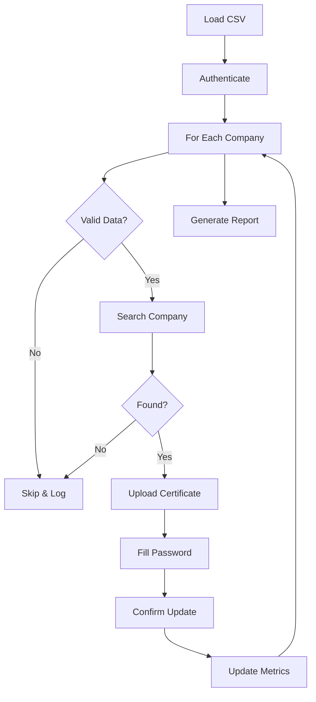

# 🔐 Certificate Manager

> Automated digital certificate management system for batch processing


## 🎯 Overview

**Certificate Manager** is a professional automation tool that streamlines the process of updating digital certificates for multiple companies in a corporate web platform. It processes certificates in batch, validates company data, and provides detailed execution metrics.

### Key Features

- ✅ **Batch Processing** - Update certificates for hundreds of companies automatically
- ✅ **Smart Validation** - Validates CNPJ format and file existence before processing
- ✅ **Robust Error Handling** - Retry logic and comprehensive error reporting
- ✅ **Real-time Metrics** - Track progress, success rate, and estimated completion time
- ✅ **Secure Configuration** - Environment-based credentials (no hardcoded passwords)
- ✅ **Detailed Logging** - Complete audit trail of all operations

## 📸 Screenshots

*[Add screenshots of the tool in action]*

## 🚀 Quick Start

### Prerequisites

- Python 3.10 or higher
- Google Chrome browser
- Digital certificates (.pfx files)
- Valid credentials for the target platform

### Installation

1. **Clone the repository**
   ```bash
   git clone <repository-url>
   cd certificate-manager
   ```

2. **Create virtual environment**
   ```bash
   python -m venv .venv
   .venv\Scripts\activate  # Windows
   # or
   source .venv/bin/activate  # Linux/Mac
   ```

3. **Install dependencies**
   ```bash
   # Install selenium-core library
   pip install -e ../selenium-core
   
   # Install project dependencies
   pip install -r requirements.txt
   ```

4. **Configure environment**
   ```bash
   # Copy example environment file
   copy .env.example .env  # Windows
   # or
   cp .env.example .env  # Linux/Mac
   
   # Edit .env with your credentials
   notepad .env  # Windows
   # or
   nano .env  # Linux/Mac
   ```

5. **Prepare data file**
   
   Create `data/certificates.csv` with the following format:
   ```csv
   inscricao_federal,nome,caminho_raiz,caminho_arquivo,senha
   12.345.678/0001-90,Company Name,C:\Certificates,certificate.pfx,password123
   98.765.432/0001-10,Another Company,C:\Certificates,another.pfx,pass456
   ```

### Usage

```bash
python src/main.py
```

The tool will:
1. Open the browser and authenticate
2. Load companies from CSV
3. Process each company sequentially
4. Update certificates with retry logic
5. Display progress and metrics
6. Generate detailed logs

## 📊 How It Works



### Process Flow

1. **Data Loading** - Reads company data from CSV with validation
2. **Authentication** - Logs into the platform securely
3. **Company Search** - Searches by federal inscription (CNPJ)
4. **Certificate Upload** - Uploads .pfx certificate file
5. **Password Entry** - Fills certificate password
6. **Confirmation** - Confirms and saves changes
7. **Metrics Tracking** - Records success/failure and timing

## 🛠️ Tech Stack

- **Python 3.10+** - Core language
- **Selenium WebDriver** - Browser automation
- **Pandas** - Data processing
- **Pydantic** - Configuration management
- **selenium-core** - Shared automation library

## 📁 Project Structure

```
certificate-manager/
├── src/
│   ├── __init__.py
│   ├── main.py                  # Entry point
│   ├── config.py                # Configuration with Pydantic
│   ├── certificate_updater.py   # Certificate update logic
│   └── company_processor.py     # Batch processing logic
├── data/
│   ├── .gitkeep
│   └── certificates.csv         # Input data (not tracked)
├── logs/
│   └── YYYYMMDD.log            # Daily logs (auto-generated)
├── screenshots/
│   └── .gitkeep
├── .env.example                 # Environment template
├── .gitignore
├── requirements.txt
└── README.md
```

## ⚙️ Configuration

### Environment Variables

| Variable | Description | Default | Required |
|----------|-------------|---------|----------|
| `APP_URL` | Platform URL | - | ✅ |
| `APP_USERNAME` | Login username | - | ✅ |
| `APP_PASSWORD` | Login password | - | ✅ |
| `HEADLESS` | Run browser in headless mode | `false` | ❌ |
| `WINDOW_SIZE` | Browser window size | `1920,1080` | ❌ |
| `BLOCK_IMAGES` | Block images (2=yes, 1=no) | `2` | ❌ |
| `DATA_FILE` | CSV filename | `certificates.csv` | ❌ |

### CSV Format

The input CSV must have these columns:

- `inscricao_federal` - Company CNPJ (formatted or not)
- `nome` - Company name
- `caminho_raiz` - Root path for certificates (optional)
- `caminho_arquivo` - Certificate filename or full path
- `senha` - Certificate password

## 📈 Metrics & Reporting

The tool provides real-time metrics:

```
============================================================
Progress: 45/100 (45.0%)
✅ Success: 42 | ❌ Failed: 2 | ⏭️ Skipped: 1
📊 Success Rate: 95.5%
⏱️ Avg Time: 3.24s
⏳ Est. Remaining: 2.9 min
⏰ Total Elapsed: 2.4 min
============================================================
```

All operations are logged to `logs/YYYYMMDD.log` with timestamps and details.

## 🔒 Security Best Practices

- ✅ Credentials stored in `.env` (not tracked by git)
- ✅ `.env.example` provided as template
- ✅ No hardcoded passwords in source code
- ✅ Certificate files not tracked in repository
- ✅ Logs excluded from version control

## 🐛 Troubleshooting

### Common Issues

**"Login failed"**
- Verify credentials in `.env`
- Check if platform URL is correct
- Ensure account is not locked

**"Certificate file not found"**
- Verify file paths in CSV
- Check if `caminho_raiz` is correct
- Ensure certificate files exist

**"Company not found"**
- Verify CNPJ format in CSV
- Check if company exists in platform
- MEI companies may not be supported

**Browser doesn't open**
- Install Google Chrome
- Check `CHROME_BINARY` path if using custom installation
- Try setting `HEADLESS=false` to see browser

## 📝 Development

### Code Quality

The project follows best practices:
- Type hints for better IDE support
- Comprehensive error handling
- Modular architecture
- Detailed logging
- Configuration validation

### Extending

To add new features:

1. Create new module in `src/`
2. Import from `selenium_core` for common functionality
3. Update `config.py` for new settings
4. Add tests (if applicable)

## 🤝 Contributing

This is a portfolio project, but suggestions and improvements are welcome!

## 📄 License

MIT License - feel free to use this project as reference for your own automation needs.

## 👤 Author

**Wgledston Belizário Silva**
- Portfolio: [studio.worple.com.br]
- LinkedIn: [linkedin.com/in/wgledston]
- GitHub: [github.com/wgledston]

---

**Note**: This tool is designed for legitimate business automation. Always ensure you have proper authorization before automating interactions with any web platform.
